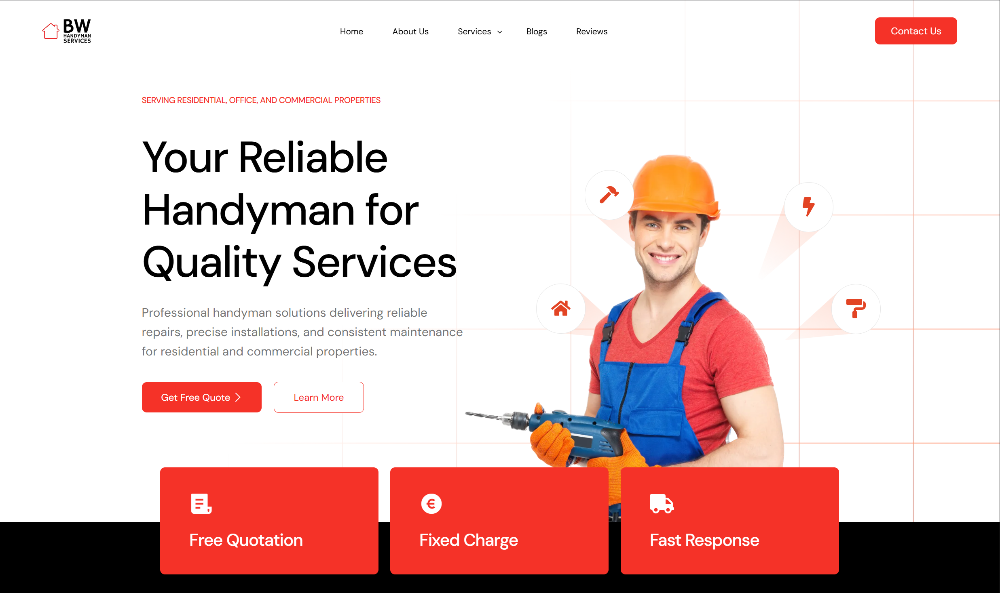
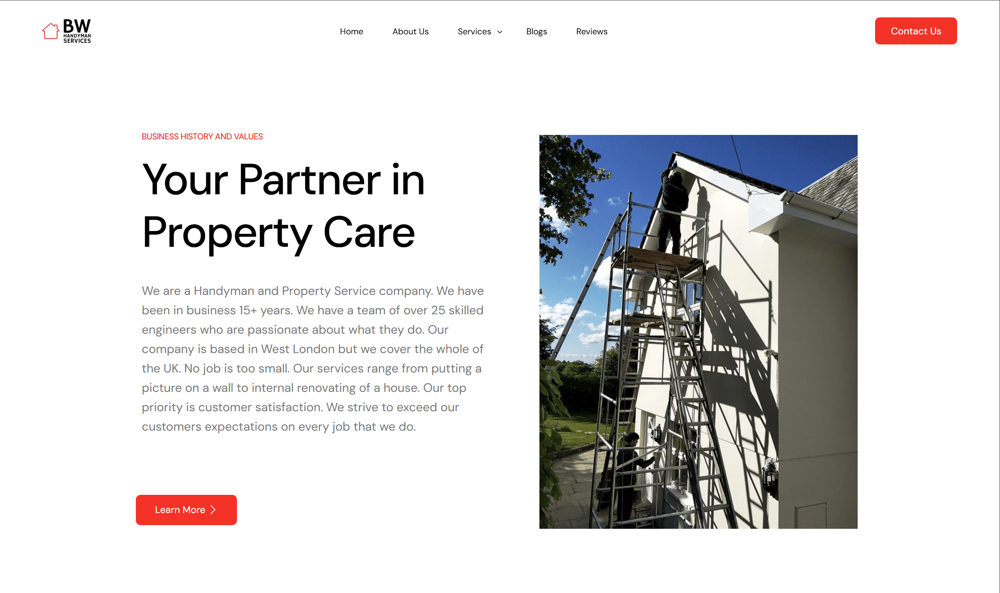
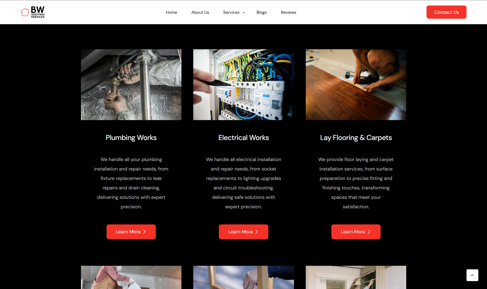
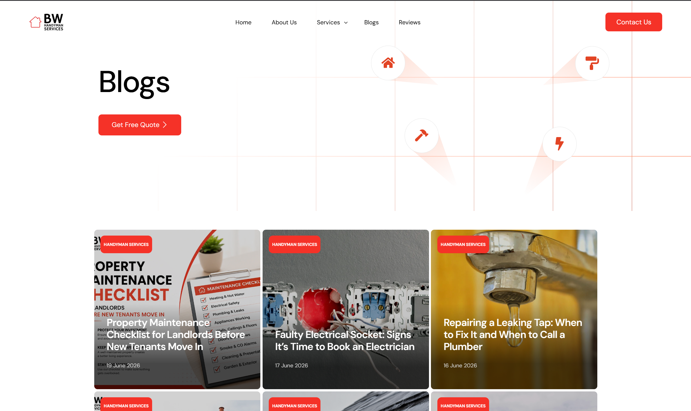
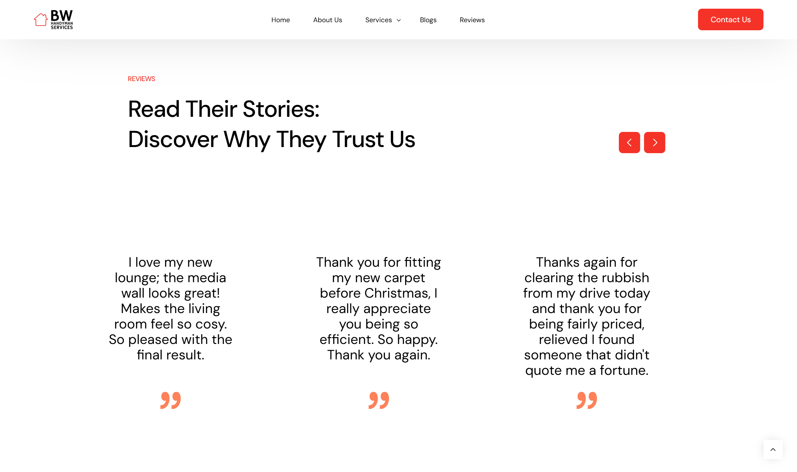
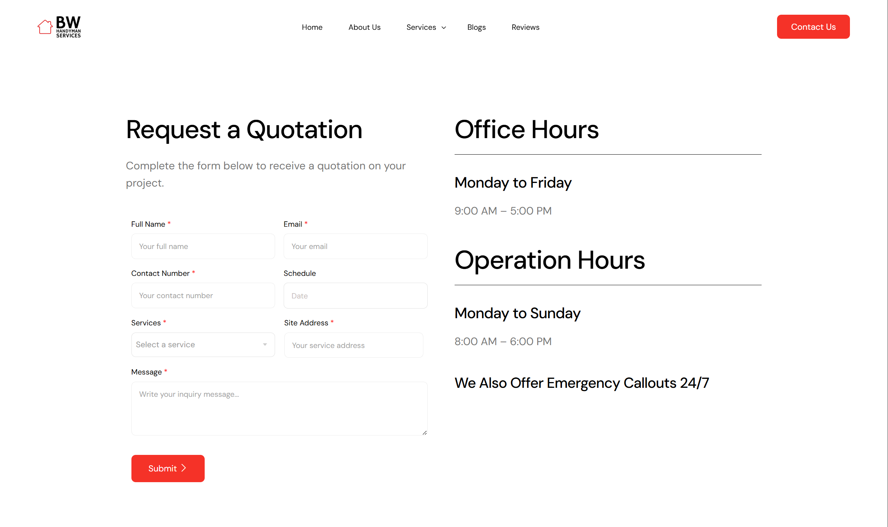
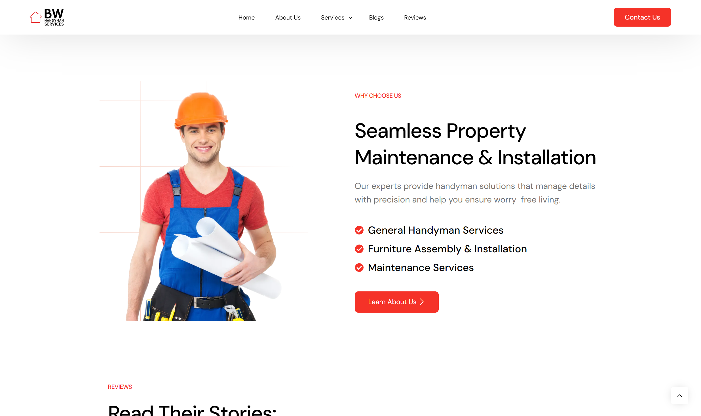
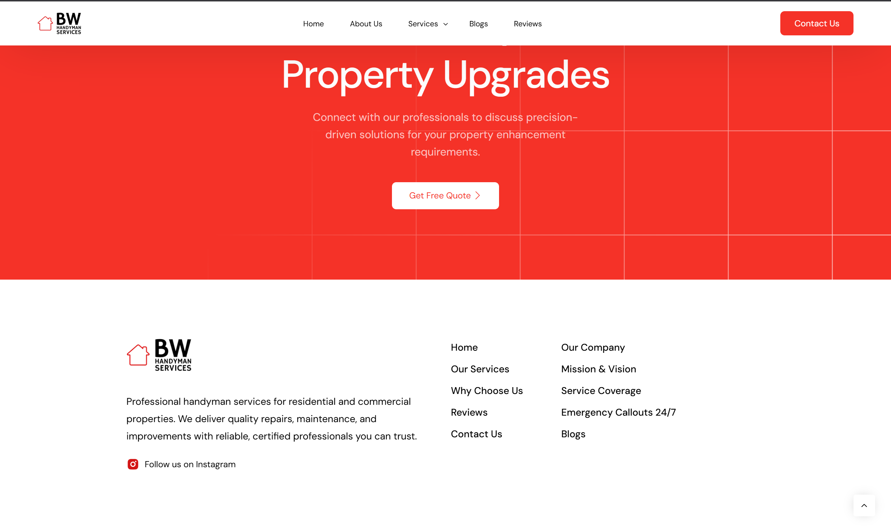

# BW-Handyman-Services-WP-Website

> Redesigned a pre-built template website to match client's specific demands and branding preferences using WordPress and Elementor. Generated and wrote original website content and copy from scratch, covering services. Structured responsive layouts web pages and navigation for clear and accessible user experience across all devices. Applied SEO best practices including meta tags, alt texts, and page titles to improve search visibility.

**Live Site:** [bwpm.uk](https://bwpm.uk/)

---

## 🛠 Built With

This site was built using **WordPress + Elementor's visual page builder**. No custom theme or plugin code was required — my contributions focused on design, layout, configuration, and optimization.

---

## ✨ My Contributions

- Designed and built full page layouts using Elementor (homepage, about us, services, reviews, contact us)
- Configured responsive design across mobile/tablet/desktop
- Set up on-page SEO (meta titles, descriptions, sitemap, schema)
- Configured SMTP for reliable contact form email delivery
- Implemented security hardening (login protection, firewall, SSL)

---

## 🖼 Gallery

| Homepage | About Us Page | Services Page |
|:---:|:---:|:---:|
|  |  |  |
| Blogs Page | Reviews Page | Contact Us Page |
|  |  |  |
| Why Choose Us Section | Footer Section | 
|  |  | 

---

## 🧩 Notable Decisions / Challenges

- **Challenge:** [e.g. Contact form emails weren't being delivered]
  **Solution:** [e.g. Configured SMTP with proper SPF/DKIM records via WP Mail SMTP]

- **Challenge:** [e.g. Slow load times on mobile]
  **Solution:** [e.g. Optimized images, enabled caching plugin]

---

## 📌 Project Notes

- Type: Client Project
- Timeline: Jan 2026 - Feb 2026
- Role: Lead Developer

---

## 📄 License

This documentation is shared for portfolio purposes. Site content and branding belong to the respective site owner.
